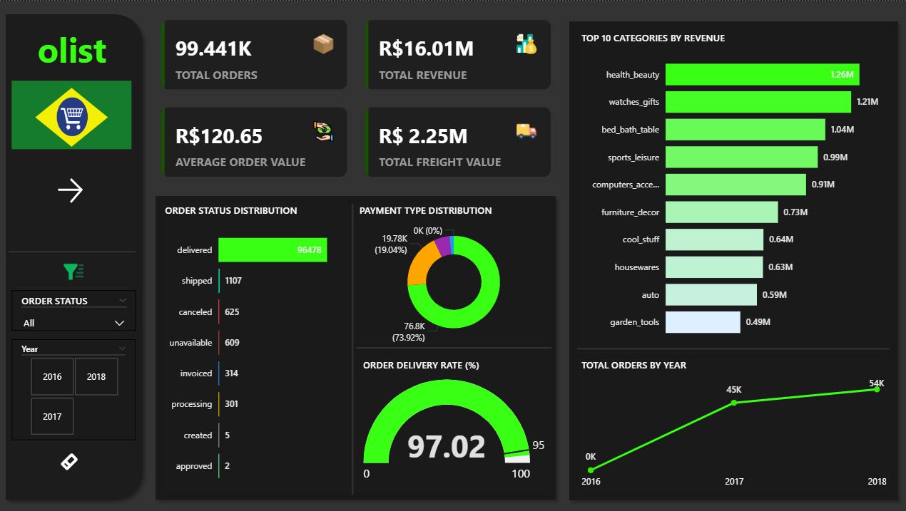
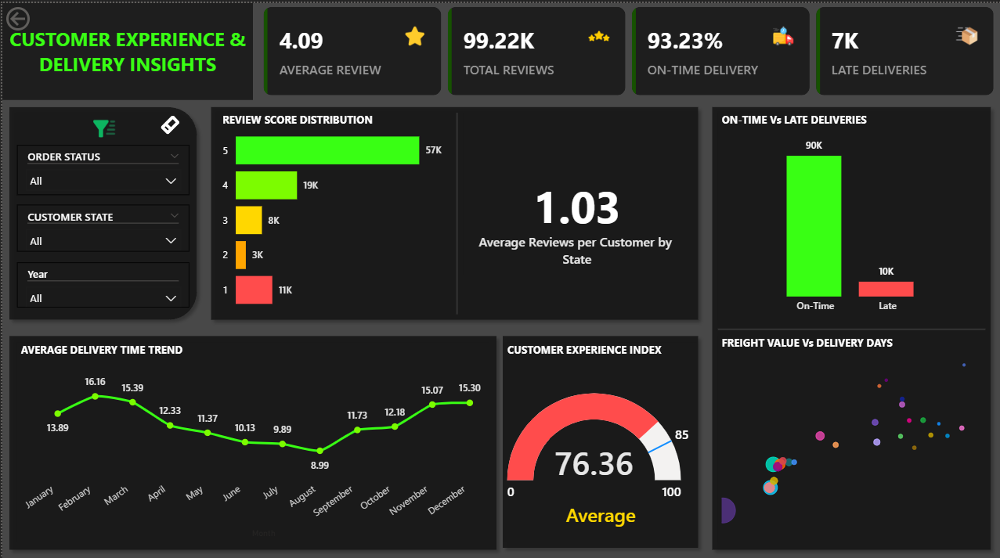

# 🛒 Olist E-Commerce Analysis (Brazil)

A Power BI project analyzing **Brazil’s leading e-commerce platform — Olist**, to uncover key insights about **sales performance**, **customer experience**, and **delivery efficiency**.

---

## ✨ Project Highlights

- 📈 Designed **two interactive Power BI dashboards** focused on sales and customer experience.  
- 🧹 Performed **ETL in Power Query** to clean and model complex datasets.  
- ⚙️ Built **DAX measures** for KPIs like On-Time Delivery Rate and Customer Satisfaction Index.  
- 🎨 Used a **black and neon green theme** for a modern, high-contrast design.  

---

## 📁 Project Structure

📂 Brazilian-Ecommerce-Analysis
│
├── 📁 dashboard
│   ├── dashboard1.png
│   └── dashboard2.png
├── 📁 images
│   └── (Icons, logos, and images used in the project)
│ 
│
└── README.md

> ⚠️ **Note:** Full datasets and Power BI `.pbix` file are **not included** due to file size.  

---

## 📂 Dataset

Public dataset from Kaggle:  
🔗 [Brazilian E-Commerce Public Dataset by Olist](https://www.kaggle.com/datasets/olistbr/brazilian-ecommerce)

---

## 📄 Power BI File

Download the full **Power BI report** here:  
🔗 [Olist E-Commerce Power BI Report (.pbix)](https://drive.google.com/file/d/1gONGQP63V0iAsS7fbissXF2YNuoSLB-Y/view?usp=drive_link)

---

## 📊 Dashboards Overview

### 💼 **Dashboard 1: Sales & Performance Overview**
- Analyzes **order trends**, **payment types**, and **top-performing products**.  
- Visualizes **order status counts**, **sales distribution**, and **payment type ratios**.  
- Helps identify top-selling items and preferred customer payment channels.

🖼️ *Preview:*  

---

### 🚀 **Dashboard 2: Customer Experience & Delivery Insights**
- Focuses on **customer reviews**, **delivery performance**, and **on-time delivery rate**.  
- Combines delivery metrics with satisfaction data to calculate the **Customer Experience Index**.  
- Highlights **late deliveries**, **average delivery days**, and **state-wise performance**.

🖼️ *Preview:*  

---

## 🧠 Tools & Techniques

- **Power BI** → ETL, Modeling, and Visualization  
- **DAX** → Custom measures for KPIs  
- **Power Query** → Data cleaning and transformation  
- **Theme** → Black & Neon Green (modern and high-contrast)

---

## 📈 Key Insights

- 💳 **Credit Card** dominates payment methods (~75% usage).  
- 🚚 **Majority of deliveries** are completed on time, with few delays.  
- 💰 **Freight costs** don’t always correlate with faster delivery.  
- 🌎 **Top states** contribute heavily to positive reviews and repeat customers.

---

## 👨‍💻 Author

**Firdos Shaik**  
Aspiring Data Analyst | Power BI Developer  

📍 Hyderabad, India  
📧 fidduraza9876@gmail.com  
🔗 [LinkedIn](https://www.linkedin.com/in/firdos-shaik-551b4222b/)

---

## 🏷️ Tags & Hashtags

`#PowerBI` `#DataAnalytics` `#BusinessIntelligence` `#EcommerceAnalysis`  
`#CustomerInsights` `#DataVisualization` `#OlistProject` `#DataDriven`

---

